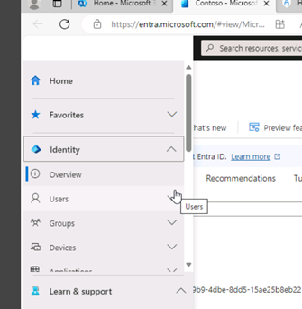
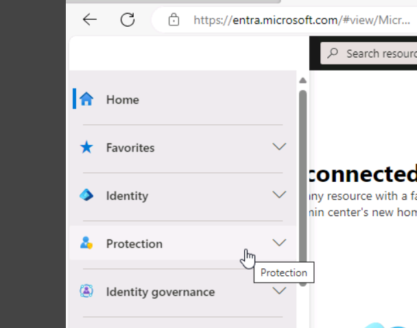
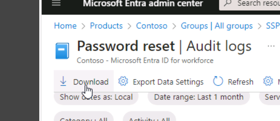

# Microsoft 365 (Azure/Entra/Purview)

Cloud Security and Compliance

Microsoft 365 are automatically using Azure AD, so you can access Azure Entra AD features and services through either the Microsoft 365 admin portal or through the Azure portal. 

Scenario 1: Account configuration
•	Create users, add to groups, assign licenses.
•	Configure authentication process by enabling password reset and configuring the settings.
•	Add users to Self-service password reset group.

Scenario 2: Analytics 
Use the Audit logs and the Usage & insights data associated with password resets by users.

Scenario 3: Set up Multi-Factor Authentication (MFA)
Create a policy that will require a user to go through multi-factor authentication when accessing any of the Microsoft Admin portals

Scenario 4: Privileged Identity Management (PIM)
Configure one of your users, Diego Siciliani, with a Microsoft Entra user administrator role, through Privileged ID management (PIM). With user admin privileges, Diego will be able to create users and groups manage licenses, and more. Both the admin and the user, Diego, must be configured for Microsoft Entra ID P2 licensing.

Scenario 5: Compliance
Create a Data Loss Prevention Policy and check existing ones are suitable.

 
 

Scenario 1
Create users

 

 

 

 

Begin auditing user and admin activity to enable logs for analysis.

 

 

Assign licenses.

 

 
 

 
 

 

Next, I configured the authentication methods and settings. 
 

 
 

 
 

 
 

 
 

 
 

 
 

Add users to Self-service password reset group.
 

 

 
 

 
 

 
 

 
 

 
 

Scenario 2: Analytics 
Use the User sign-in logs, audit logs and the Usage & insights data associated with password resets by users.
 

 

 
 

 
 

 
 

 
 

 
 

 
 

 
 

 

 
Scenario 3: Multi-factor Authentication
Create a policy that will require a user to go through multi-factor authentication when accessing any of the Microsoft Admin portals
 

 

 
 

 
 

 
 

 
 

 
 

 
 

 
 

 

 
Scenario 4: Privileged Identity Management (PIM)
Configure one of your users, Diego Siciliani, with a Microsoft Entra user administrator role, through Privileged ID management (PIM). With user admin privileges, Diego will be able to create users and groups manage licenses, and more. Both the admin and the user, Diego, must be configured for Microsoft Entra ID P2 licensing.
 

 

 
 

 
 

 

 

Uncheck the permanently eligible box as this is a time-limited privilege.
 

 

 
 

 
 

 

 

Scenario 5: Compliance
Create a Data Loss Prevention Policy and check existing ones are suitable.

Go to the Compliance admin centre (Purview) and create custom policy as well as verifying existing ones are correct.
 

 

 
 
Click create policy and complete information relevant to your organisation.
Next, check existing policies such as the GDPR one.

 
 

 
 

 

 
The i box will give more information but essentially the high confidence setting will mean the system will check for a credit card AND a key word before it creates an alert as part of the DLP.
